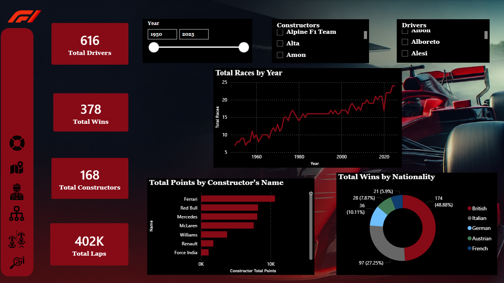
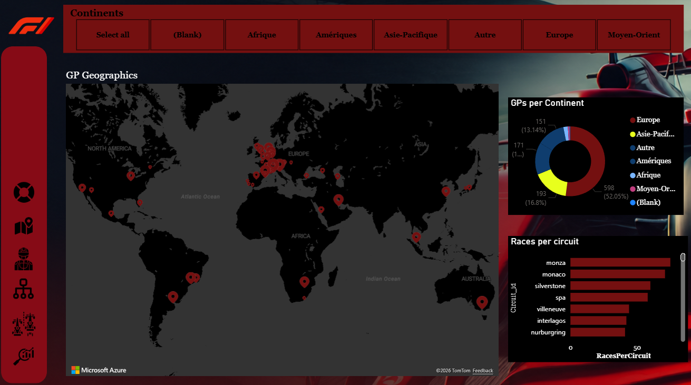
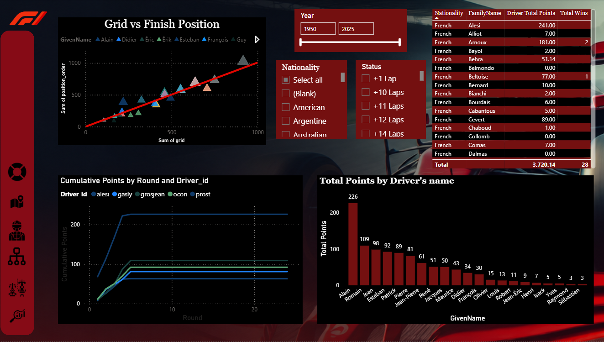
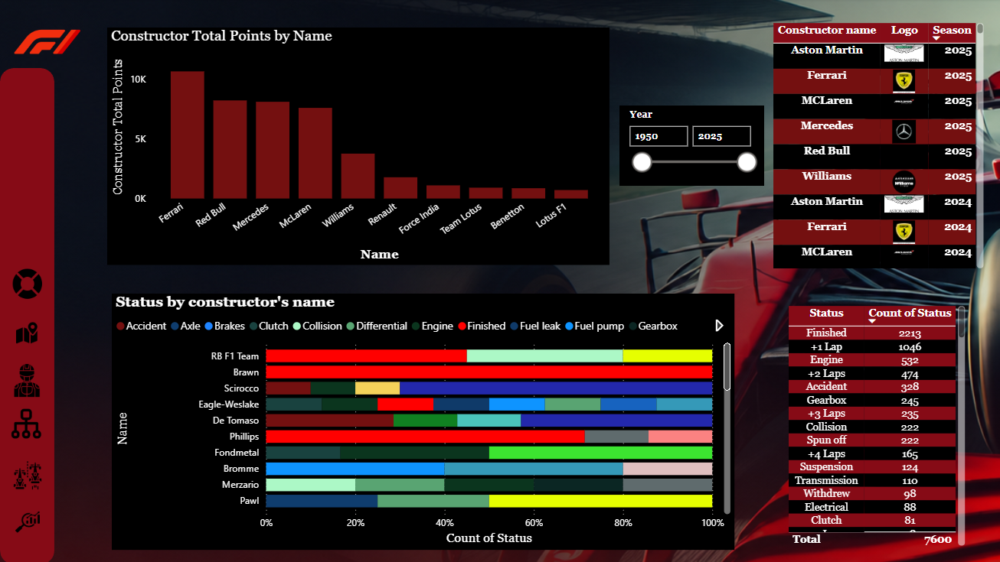

# 🏎️ Formula 1 — Performance Analytics Dashboard
> Business Intelligence project built with **Power BI** | Data: Kaggle F1 Dataset  
> Coverage: **1950 – 2025**


---

## 📌 Project Overview

This Business Intelligence dashboard provides a comprehensive analysis of **Formula 1 race performance** across 75 years of racing history (1950–2025). Built as part of a Business Data Analytics academic project, it transforms raw historical F1 data into **interactive visual insights** covering driver performance, constructor dominance, geographic distribution of GPs, and the latest 2025 season.

The dashboard is fully interactive , filters on Year, Constructor, Driver, Nationality, and Continent allow dynamic exploration of the data across all pages.

---

## 🎯 Key Business Questions Answered

- Which constructors have accumulated the most points across F1 history?
- How does a driver's grid position correlate with their finishing position?
- Which nationalities and continents have dominated F1 wins?
- How are Grand Prix circuits distributed globally?
- What are the reliability patterns (DNFs, mechanical failures) per constructor?
- How do cumulative points evolve across a season by driver?

---

## 📊 Dashboard Pages

| Page | Visuals | Key Insight |
|------|---------|-------------|
| 🏠 **F1 Overview** | KPI cards, Total Races by Year line chart, Points by Constructor bar chart, Wins by Nationality donut | Ferrari leads all-time constructor points; British drivers account for 48.88% of all wins |
| 🗺️ **World Map** | Azure map with GP locations, GPs per Continent donut, Races per Circuit bar chart | Europe hosts 52% of all GPs; Monza, Monaco & Silverstone are the most-raced circuits |
| 👤 **Drivers** | Grid vs Finish Position scatter, Cumulative Points by Round line chart, Total Points bar chart, driver stats table | Strong linear correlation between grid and finish position; Alain Prost leads French drivers with 226 pts |
| 🌍 **Tree Map — Wins by Nationality** | Treemap of wins broken down by driver nationality | British and German drivers historically dominate win counts |
| 🏭 **Constructors** | Constructor Total Points bar chart, Status by Constructor stacked bar, Constructor logos table, Status count table | Ferrari leads with ~10K pts; "Finished" is the most common status (2213), Engine failures rank 3rd (532) |
| 🏁 **2025 Season Evaluation** | Current season standings and performance breakdown | Live 2025 season snapshot with current constructor & driver standings |

---

## 🗂️ Repository Structure

```
F1-BI-Dashboard/
│
├── 📊 F1_BI.pbix                        # Main Power BI dashboard file
│
├── 📁 data/
│   └── raw/                             # Source datasets 
│       ├── races.csv
│       ├── drivers.csv
        ├── driver.standings
│       ├── constructors.csv
        ├── constructor_standing
│       ├── results.csv
│       ├── circuits.csv
        ├── f1_2025_last_race_results
│       └── qualifying.csv
        
│
├── 📁 screenshots/
│   ├── 01_f1_overview.png
│   ├── 02_world_map.png
│   ├── 03_drivers.png
│   ├── 04_treemap_nationality.png
│   ├── 05_constructors.png
│   └── 06_2025_season.png
│
└── README.md
```

---

## 🛠️ Tech Stack

| Tool | Usage |
|------|-------|
| **Power BI Desktop** | Dashboard design & visualisation |
| **Power Query (M)** | Data cleaning, null filtering, transformations |
| **DAX** | Custom KPIs, calculated measures, cumulative totals |
| **Azure Maps** | Geographic GP circuit mapping |


---


## 🚀 How to Open

1. Download and install [Power BI Desktop](https://powerbi.microsoft.com/desktop/) *(free)*
2. Clone this repository:
   ```bash
   git clone https://github.com/Feriel5ben/F1-BI-Dashboard.git
   ```
3. Open `F1_BI.pbix` in Power BI Desktop
4. If prompted, refresh the data source and point to your local `/data/raw/` folder

---

## 📷 Dashboard Preview

| F1 Overview | World Map |
|---|---|
|  |  |

| Drivers | Constructors |
|---|---|
|  |  |

---

## 👩‍💻 Author

**Feriel** — Master's student in Business Data Analytics | IBS University of Buckingham (Budapest)  

---

## 📄 License

Academic & portfolio project.  
Data sourced from [Kaggle](https://www.kaggle.com/) — publicly available datasets.
